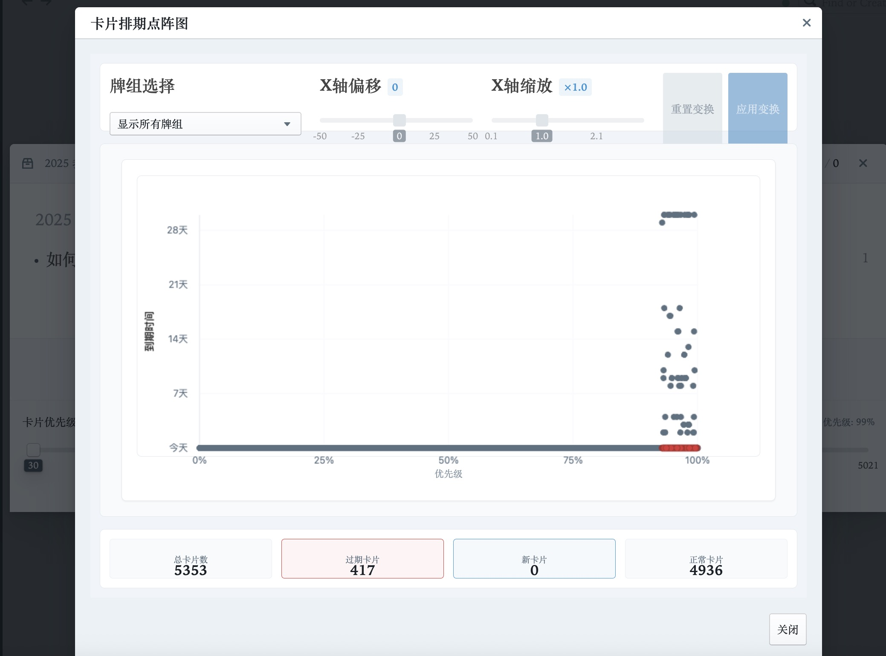

# Memo Enhanced - 优化版间隔重复插件

<p align="center">
  <strong>原版本演示：</strong><br/>
  
</p>

<p align="center">
  <strong>优化版本演示：</strong><br/>
  
</p>


> 🙏 **致谢**：本项目基于 [digitalmaster/roam-memo](https://github.com/digitalmaster/roam-memo) 开发，感谢原作者 [@digitalmaster](https://github.com/digitalmaster) 的杰出工作！同时特别感谢 [L-M-Sherlock (Jarrett Ye)](https://github.com/L-M-Sherlock) 老师对渐进阅读学习原理和方法的无私推广，受益匪浅。

一个专为 Roam Research 设计的渐进阅读插件。类似于 [supermemo](https://supermemo.guru/wiki/SuperMemo)，采用科学的记忆算法和制卡流程帮助你高效记忆任何内容。

## ✨ v2.3.0 功能亮点

### 智能牌组管理
- **批量优先级管理**：通过卡片排期点阵图，你可以对所有牌组进行点阵图上的排期管理，横坐标为队列优先级，纵坐标为间隔重复的时间周期，这个点阵反应的是全局的排期，所有卡片在一个全局系统中进行优先级的管理，符合 supermemo 所强调的渐进阅读和混合学习原则。

### 全局混合学习
- **智能学习模式切换**: 在顶部栏一键切换"单组"或"混合"学习模式，插件会自动记住您的选择。
- **跨牌组优先级排序**: 在混合模式下，所有卡片的学习顺序将由您设置的全局优先级决定。
- **实时统计**: 插件主界面会实时更新全局待学卡片的总数。

### 🎯 体验与修复
- **原插件层级混淆 修复** - Roam-memo 插件会造成层级错误，遮挡点击放大后的 Roam 图片浮窗，遮挡弹出的双链候选菜单。
- **原插件焦点丢失 修复** - Roam-memo 插件窗口内的换行行为，会导致焦点丢失无法继续编辑内容，现已修复。

## 🧠 智能调度算法选择器

插件现在支持两种先进的记忆算法，让你的学习更科学！

#### 📖 SM2 算法（经典稳定）
- 基于 [SuperMemo 2](https://super-memory.com/english/ol/sm2.htm) 算法的改良版本
- 经过多年验证，稳定可靠
- 适合大多数用户的日常学习需求

#### 🚀 FSRS 算法（现代AI）
- **Free Spaced Repetition Scheduler** - 基于机器学习的现代算法
- 提供更准确的长期记忆预测和复习时间安排
- 在最新科学研究中证明优于传统算法

**💡 使用方法：**
1. 打开插件设置页面
2. 找到"调度算法选择 / Scheduling Algorithm"选项
3. 用开关选择是否开启FSRS 算法，不开启默认 SM2 算法
4. 新建卡片将使用选择的算法
5. 注意算法彼此数据暂不互通，切换算法不会破坏彼此的历史数据。

> **🔄 复习模式切换**：练习时右下角的 `AUTO ⇄ FIX` 开关用于切换复习模式，与SM2/FSRS算法选择无关。

## 📦 安装方法

在 Roam Research 的扩展页面roam deport中打开开发者模式，添加以下地址：

```
https://raw.githubusercontent.com/issaker/roam-Incremental-Reading/main/extension.js
```

**安装步骤：**
1. 打开 Roam Research
2. 点击右上角设置图标 → Settings
3. 选择 "Roam deport" 标签页
4. 在 "Developer Extensions" 中打开链接图标按钮，粘贴上述地址
5. 点击 "load remote extension" 按钮
6. 重新加载页面完成安装

## 🚀 快速开始

1. **摘录卡片**：为任何想要记忆的块添加 `#memo` 标签（或自定义标签）
2. **开始复习**：点击roamresearch侧边栏的 "Review" 按钮启动学习
3. **智能复习**：根据记忆算法安排的时间复习闪卡

> **💡 小贴士**：子块被视为"答案"，初始状态隐藏。点击"显示答案"来查看它们。
默认所有具备双链的卡片都会进入渐进阅读，如果你想排除这张卡，可以手动设置它的渐进阅读时间为 100 年或更久，这么做是为了通过更全面的渐进阅读让你不遗漏自己的知识点。

## 📚 核心功能

### 🎯 什么是间隔重复？

间隔重复是一种基于记忆规律的学习技术：
- 根据你的记忆程度智能安排复习时间
- 难记的内容增加复习频率，熟悉的内容延长间隔
- 这是将大量知识从短期记忆转化为长期记忆最有效的方法


### 🎭 文本遮挡（填空练习）

挑战你的记忆力，隐藏文本的关键部分，变成填空题：
- Roam 快捷键 Ctrl+H 高亮功能，使用 `^^` 包围文本：`^^隐藏我^^`
- 或使用大括号：`{我也被隐藏}`
- 注意：如果你不是 Roam 的默认 css 主题，可能会出现挖空遮挡失效的情况。

### 📊 每日限制

设置每日复习限制来控制学习时间：
- 在插件设置页面配置每日复习卡片上限
- 系统确保至少 ~25% 的卡片是新卡片，保持学习平衡

### 🎓 强化模式

完成当日到期卡片后，可选择继续"强化模式"：
- 复习卡组中的所有卡片，无论是否到期
- 适合考试冲刺，不影响正常的间隔重复调度
- 该模式可以修改和保存你的卡片优先级

### ⌨️ 键盘快捷键

| 操作 | 快捷键 | 助记说明 |
|------|--------|----------|
| 显示答案 | `空格` | Space (显示) |
| 跳过当前卡片 | `s` 或 `→` | **S**kip (跳过) |
| 返回上一张 | `←` | 左箭头 (返回) |
| 显示面包屑 | `b` | **B**readcrumb (面包屑) |
| 评分：完美记住 | `空格` | Space (完美) |
| 评分：完全忘记 | `x` | ❌ (忘记标记) |
| 评分：有点困难 | `h` | **H**ard (困难) |
| 评分：表现良好 | `g` | **G**ood (良好) |

> **📝 重要说明**：
> - 快捷键 `x` 与算法名称 FSRS **完全无关**，仅用于标记忘记！
> - 算法切换请到插件设置页面的"调度算法选择"选项
> - 练习界面的 `AUTO ⇄ FIX` 开关是复习模式切换，不是算法切换

### 🎨 命令面板集成

通过命令面板快速启动：`CMD + P` → 输入 "Memo: Start Review Session"


## 🐛 问题反馈与功能建议

如有任何问题或建议，请在 Issues 页面 提交，我们会尽快处理！

## 💖 支持项目发展

<div align="center">

如果觉得这个插件对你有帮助，欢迎给我一些激励~

[**💖 爱发电支持开发**](https://ifdian.net/item/185914144ecb11f0abea52540025c377)

**你的每一份支持都是推动项目发展的动力！** ✨

📈 支持资金将用于：
🔧 持续的功能开发与优化  
📚 用户文档与教程制作
🐛 bug修复与技术支持
</div>

## 🎉 致谢与支持
<div align="center">
  
**🙏 特别感谢**：<br/>
原作者 [@digitalmaster](https://github.com/digitalmaster) 创建了这个出色的插件<br/>
原项目地址：[digitalmaster/roam-memo](https://github.com/digitalmaster/roam-memo)<br/>
感谢 [L-M-Sherlock (Jarrett Ye)](https://github.com/L-M-Sherlock) 老师对渐进阅读学习原理和方法的无私推广，让更多人受益

</div>

## 许可证

**专有软件许可证** (Proprietary License)
版权所有 © 2025 issaker. 保留所有权利。
本软件为专有软件，受版权法保护。未经明确书面许可，不得复制、分发、修改或披露本软件及其相关文档。

---

*让学习变得更科学、更高效！🚀*
